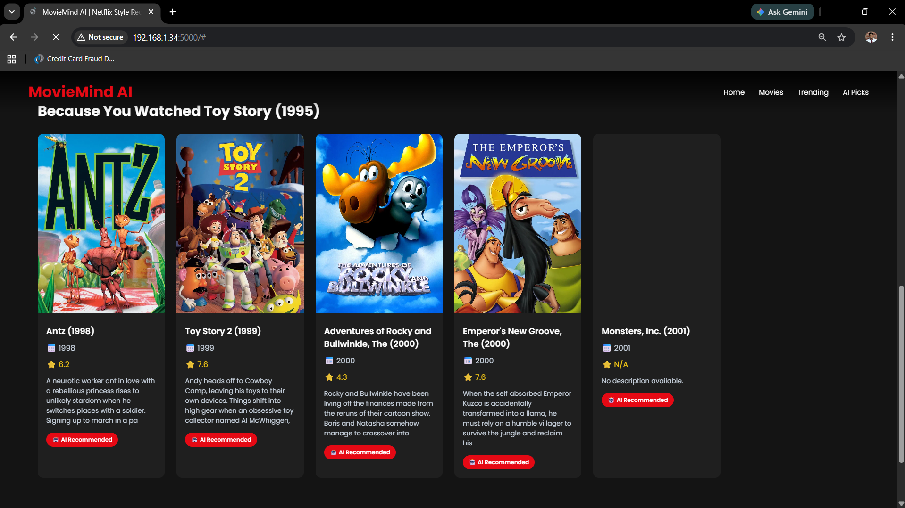

# Movie Recommendation System

A movie recommendation system built using **Machine Learning, Flask, and the TMDB API**. The application recommends similar movies using content-based filtering and displays movie posters, ratings, and other details through a streaming-platform-style web interface.

## Features

* Content-Based Movie Recommendations
* Machine Learning Powered Recommendation Engine
* Dynamic Movie Posters using the TMDB API
* Movie Ratings and Details Integration
* Netflix-Inspired User Interface
* Flask Web Application
* Responsive Design

## Tech Stack

* Python
* Flask
* Pandas
* Scikit-Learn
* HTML5
* CSS3
* JavaScript
* TMDB API
* Git & GitHub

## Project Structure

```text
Movie-Recommender/
│
├── app.py
├── tmdb.py
├── requirements.txt
├── templates/
│   └── index.html
├── services/
│   └── recommend.py
├── data/
│   └── movies.csv
└── README.md
```

## How It Works

1. The user selects a movie.
2. The recommendation engine calculates similarity scores using content-based filtering.
3. The top similar movies are retrieved.
4. The TMDB API is used to fetch movie posters and additional details.
5. The results are displayed through a Netflix-style interface.

## Screenshots

### Dashboard


### Search Movies


### Recommendations



## Running the Application

After starting the Flask application, open the following address in your browser:

```text
http://127.0.0.1:5000
```

## Note

Large model files (`*.pkl`) are excluded from this repository due to GitHub file size limitations.

## Author

**Saksham Yadav**

GitHub: https://github.com/sakshamm2

LinkedIn: https://www.linkedin.com/in/saksham-yadav-047562250/
